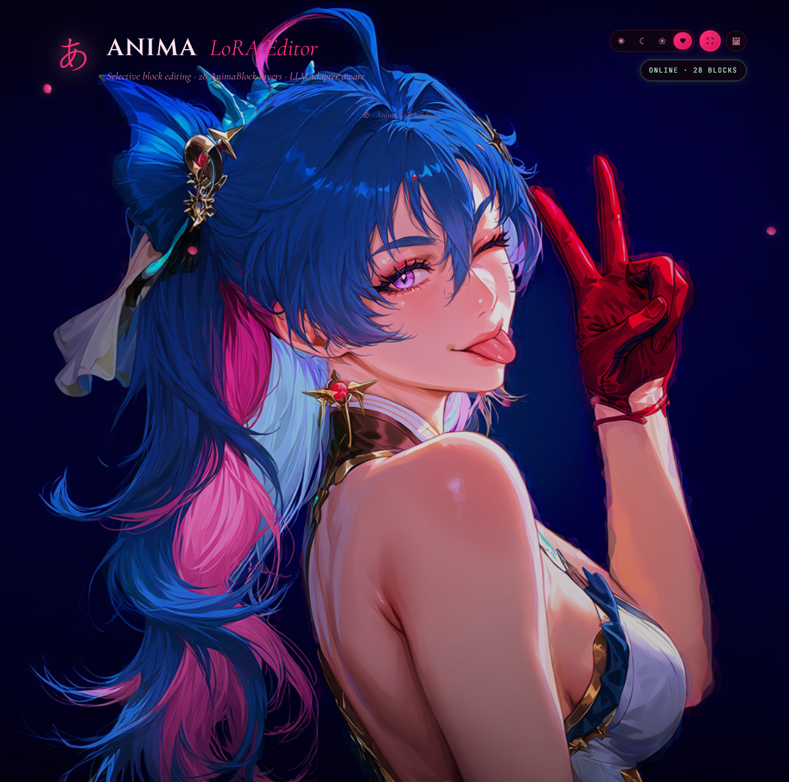
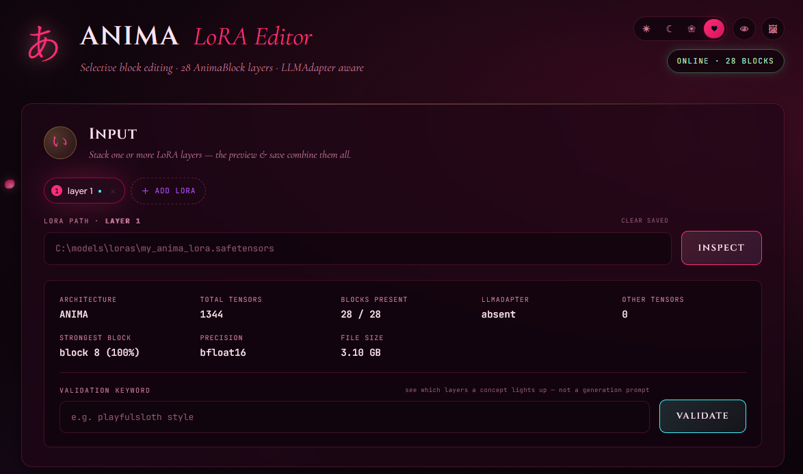
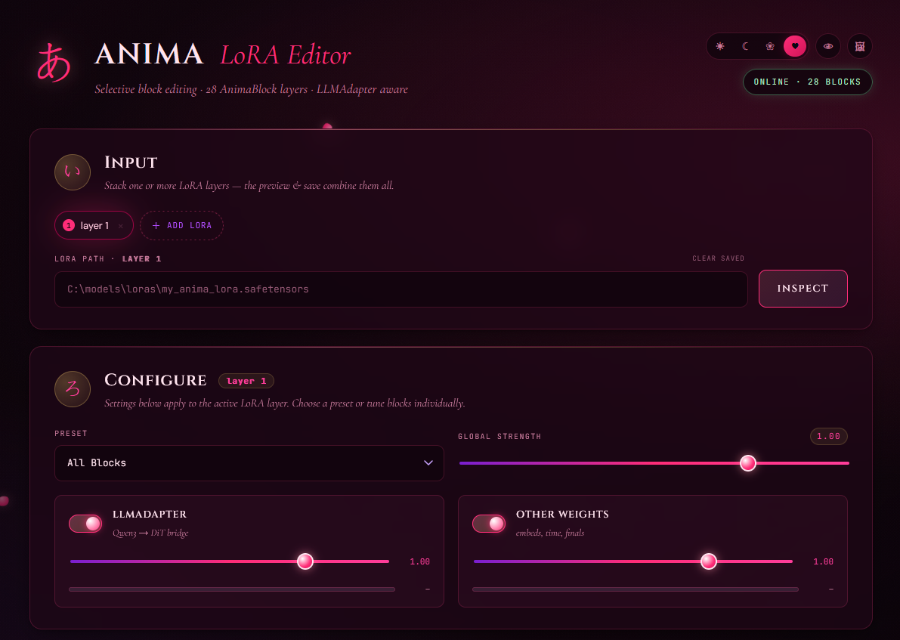
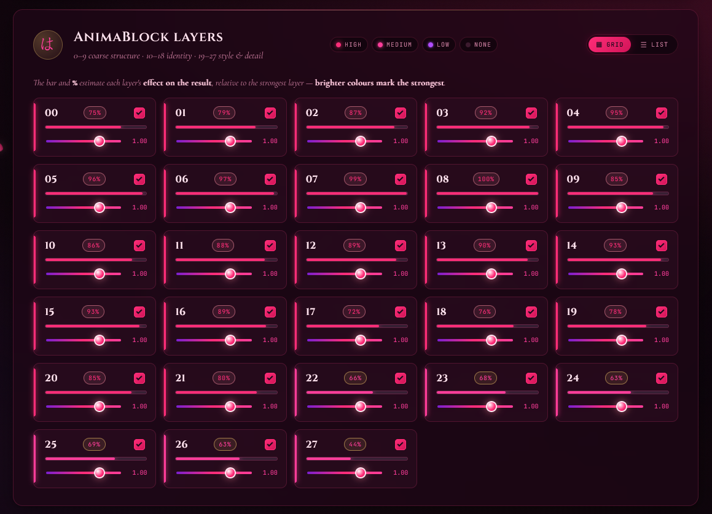
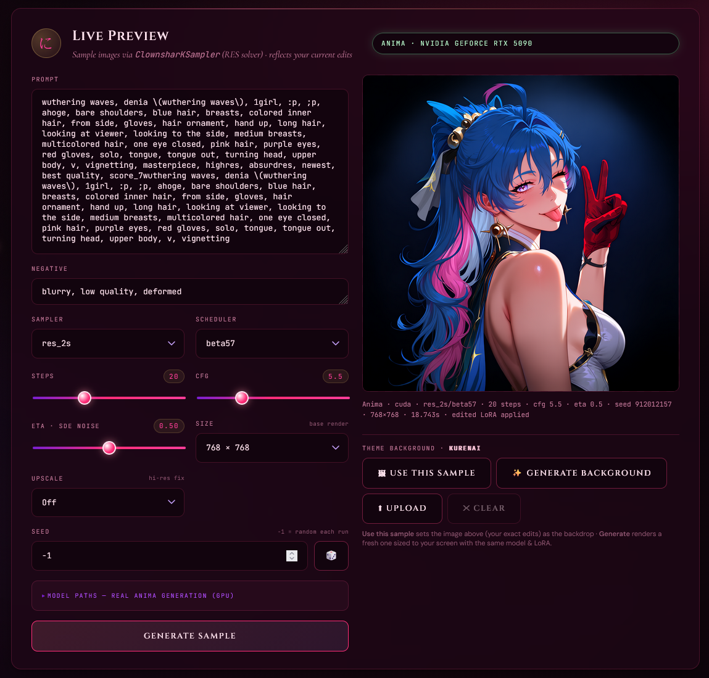
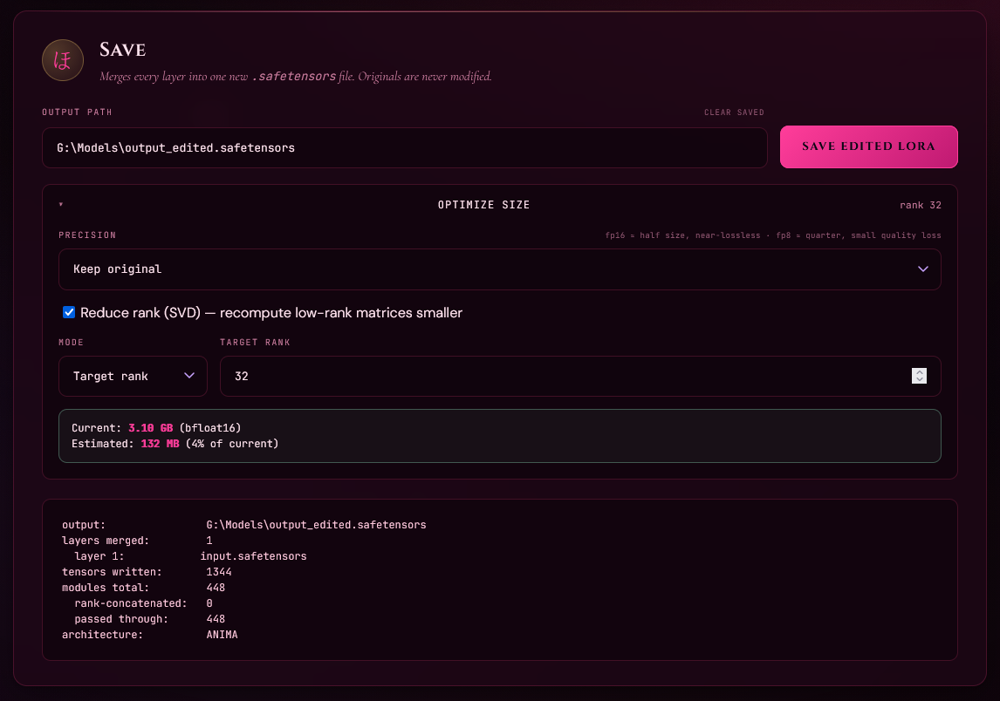

# Fix an Anima LoRA After Training — No Retrain Needed

You trained an Anima LoRA. The style is great… but it smears faces, or it's too strong, or the file is huge. Normally the fix is to retrain. **This tool lets you fix it after the fact instead.**

It's a local standalone tool: you open a finished LoRA, turn parts of it on/off, scale each part, merge several into one, and shrink the file. Your original is never touched — it always saves a fresh copy.

You'll want a CUDA GPU for the live preview / image-generation side, plus the usual Anima model files. Fair warning — this was vibe-coded, so expect some rough edges.

**Get it:** https://github.com/pclshm/anima-lora-suite

---

## The idea: a LoRA is made of layers

Anima is a 28-block diffusion transformer (plus an **LLMAdapter** bridging the Qwen3 text encoder). Your LoRA learns a bit inside each block, and the blocks do different jobs — earlier ones lean toward **structure**, later ones toward **style and detail**. That's a rough guide, not a law — which is why the tool **measures** what your specific LoRA actually uses instead of trusting labels.

The strength math is honest, too: a strength of **2.0 doubles** a block's effect (it scales only the up side, so no k² double-count), and saved files are normal `.safetensors` that load straight into ComfyUI.

---

## What you can do

- **Toggle blocks + scale each one (−2.0 to +2.0).** Make a "style only" cut, or turn down just the parts that are too strong. 12 one-click presets (Style Focus, Face Priority, Late Only…) get you started.
- **Split text from visuals** — drop the LLMAdapter to keep a LoRA's look without it hijacking your prompts (or the reverse).
- **See what matters** — Inspect scans your LoRA and colour-codes which blocks carry real weight. An optional keyword check shows which blocks light up for a specific concept.
- **Merge LoRAs** — stack several as layers, tune each, save as one file.
- **Shrink files** — fp16/bf16 (~half, lossless) or fp8 (~quarter); optional SVD rank reduction. Shows the projected size before you save.

It also warns you if the file isn't actually an Anima LoRA, and preserves the original metadata.

---

## Quick walkthrough

### 1. Select the input model and inspect it

Paste your LoRA path and hit **Inspect**. You get the architecture, how many of the 28 blocks are present, the strongest block, precision, and file size — plus a validation that confirms it really is an Anima LoRA.

> **Read the impact map:** bright blocks carry real weight, dim ones are safe to drop. The **Validation keyword** box (bottom) is *not* a generation prompt — type a concept (e.g. `playful sloth style`) to see which blocks light up for it.

### 2. Configure the layer

Pick a **preset** or tune it by hand. Set the **Global Strength**, then decide what the **LLMAdapter** (Qwen → DiT text bridge) and **Other Weights** (embeds, conv, finals) should do.

### 3. Edit the blocks

This is the heart of it: all 28 **AnimaBlock layers** (00–27), each with its own on/off toggle and strength slider. Brighter blocks matter more — disable a block to remove its contribution, or push/pull its strength to rebalance the LoRA.

> Want **style only**? Keep the later blocks, drop the early ones. **Too strong?** Lower Global strength or turn down just the brightest blocks.

### 4. (Optional) Stack layers to merge

Add more LoRAs with **+ Add LoRA**. Each becomes a layer you can inspect, validate, and tune independently — then they all merge into one file on save.

### 5. (Optional) Live Preview

Point it at your DiT / VAE / Qwen3 files and generate a sample of your *current edit* — prompt, negative, sampler, steps, CFG, resolution, and seed are all there. This is the fastest way to see whether a block change actually helped before you commit.

### 6. (Optional) Optimize size, then Save

Choose a **precision** (keep original, fp16/bf16 ≈ half size lossless, fp8 ≈ quarter) and optionally **Reduce rank (SVD)** to a target rank. The panel shows **current vs. estimated** size before you write anything.

Hit **Save Edited LoRA** — it auto-suggests an output name and writes a fresh `.safetensors`. The merge summary confirms layers merged, tensors written, and architecture. **Your original is never modified.**

---

## Common fixes

| Problem | Fix |
| --- | --- |
| Style wrecks faces | Keep later blocks, drop early ones (**Style Focus**) |
| Too strong | Lower **Global strength** or turn down the brightest blocks |
| Keep the look, free the prompt | Disable the **LLMAdapter** |
| Two LoRAs, one file | **Stack** and merge |
| Too big | **fp16** first, add fp8/SVD if needed |

---

*For CircleStone Labs' Anima. Train once, tune forever.*

